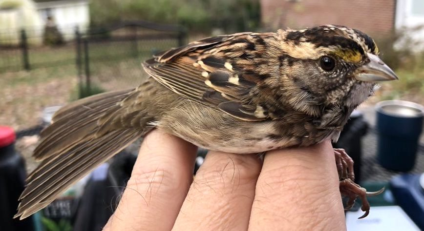
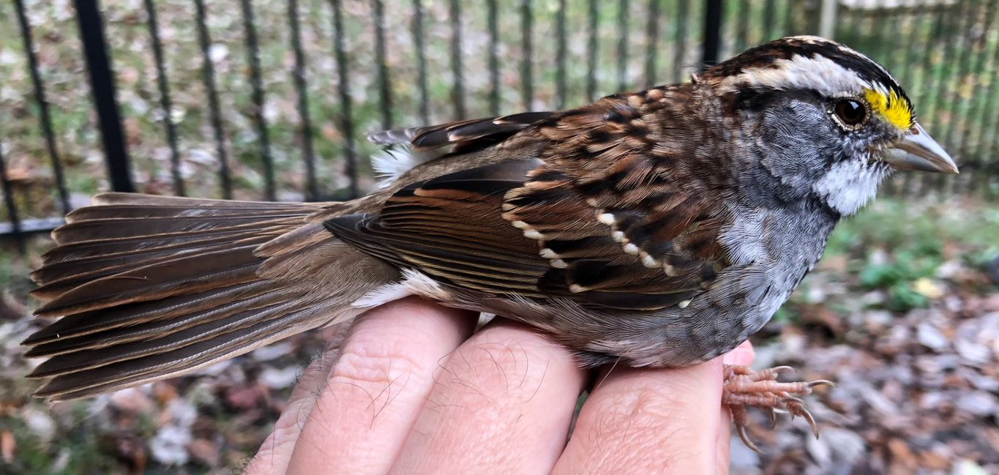

Beauchamp et al., 2020. Data from: Stopover refueling, movement, and departure decisions in the White-throated Sparrow: the influence of intrinsic and extrinsic factors during spring migration, Dryad, Dataset, https://doi.org/10.5061/dryad.v6wwpzgsv

White-throated Sparrows are a species of bird that exhibit 2 different color morphs within the species: a Tan-striped morph (top) and a White-striped morph (bottom). These morphs are a result of a large chromosomal inversion, which not only alter the coloration in the feathers, but also alter some behavioral characteristics, such as aggressiveness. 

```{r setup, include=FALSE}
library(janitor)
library(ggplot2)
library(arm)
library(ggfortify)
library(AICcmodavg)
library(grid)
```

```{r cleaning up data, include=FALSE}
WTSPdata <- read.csv("data/WTSP_data_2020.csv")
WTSPdata <- na.omit(WTSPdata) 

```

{width=50%}
{width=50%}

The white-striped sparrows have been shown to display more aggressive and territorial behaviors, over the tan-striped individuals, including defending food sources like feeders (Kopachena and Falls, 1993). This may imply that white-striped individuals will have a higher fat weight than their more timid tan-striped counterparts.

In order to analyze this, I ran a binomial generalized-mixed model to look at the relationship between the amount of fat each bird has and the color morph of the bird.

```{r visualizing raw data}
ggplot(WTSPdata, aes(fat, morph)) +
  geom_point() +
  geom_smooth() +
  xlab ("Fat (grams)") +
  ylab ("Color Morph") +
  labs(title="Raw Fit: 1 = White morph, 0 = Tan morph")

```

```{r GLM}
fit.1 <- glm(morph~fat, data=WTSPdata, binomial(link="logit"))

```

```{r}
x <- predict(fit.1)
y <- resid(fit.1)
binnedplot(x, y)

```
```{r}
coef(fit.1)
confint(fit.1)
```

```{r}
ggplot(WTSPdata, aes(fat, morph)) +
  geom_point() +
  geom_smooth(method="glm", method.args=list(family="binomial"(link="logit"))) + 
  xlab ("Fat (grams)") +
  ylab ("Color Morph")
```

```{r}
summary(fit.1)
```

In this case, the GLM of the binary White-throated Sparrow data reveals no effect of color morph on the amount of fat a bird may have.

In the model Pr(Bush support) = logit^-1(-1.40 + 0.33 · income), we can divide 0.33/4 to get 0.08: a difference of 1 in income category corresponds to no more than an 8% positive difference in the probability of supporting Bush.


---
title: "Point-Count Data"
output:
  html_document:
    df_print: paged
---