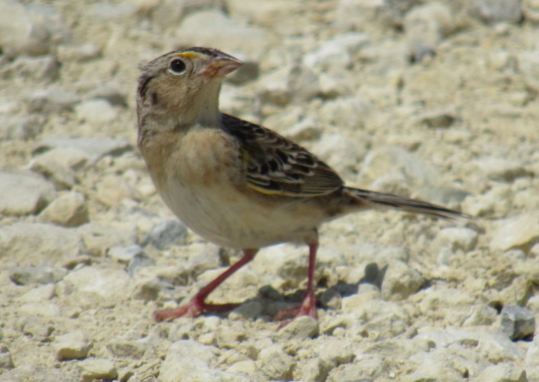

<body style="background-color:#c8d7c1">
---
title: <center><span style="color:darkgreen">White-throated Sparrow Morphs</span></center>
fontsize: 24pt
---

<center>Beauchamp et al., 2020. Data from: Stopover refueling, movement, and departure decisions in the White-throated Sparrow: the influence of intrinsic and extrinsic factors during spring migration, Dryad, [Dataset](https://doi.org/10.5061/dryad.v6wwpzgsv)</center>
$~$  
$~$  
White-throated Sparrows are a species of bird that exhibit 2 different color morphs within the species: a Tan-striped morph (top) and a White-striped morph (bottom). These morphs are a result of a large chromosomal inversion, which not only alter the coloration in the feathers, but also alter some behavioral characteristics, such as aggressiveness. 

```{r setup, include=FALSE}
library(janitor)
library(ggplot2)
library(arm)
library(ggfortify)
library(AICcmodavg)
library(grid)
```

```{r cleaning up data, include=FALSE}
WTSPdata <- read.csv("data/WTSP_data.csv")
WTSPdata <- na.omit(WTSPdata) 

```

<center>{width=60%}
{width=60%}</center>


$~$
The white-striped sparrows have been shown to display more aggressive and territorial behaviors, over the tan-striped individuals, including defending food sources like feeders (Kopachena and Falls, 1993). This may imply that white-striped individuals will have a higher fat weight than their more timid tan-striped counterparts.

In order to analyze this, I ran a binomial generalized-mixed model to look at the relationship between the amount of fat each bird has and the color morph of the bird.

First, here is a quick look at the raw fit of the data on a binomial graph:

```{r visualizing raw data, fig.align="center"}
ggplot(WTSPdata, aes(fat, morph)) +
  geom_point() +
  geom_smooth() +
  xlab ("Fat (grams)") +
  ylab ("Color Morph") +
  labs(title="Raw Fit: 1 = White morph, 0 = Tan morph")

```

```{r GLM}
fit.1 <- glm(morph~fat, data=WTSPdata, binomial(link="logit"))
display(fit.1)
```

Using a binned residual plot to verify that the data works in a binomial GLM:

```{r, fig.align="center"}
x <- predict(fit.1)
y <- resid(fit.1)
binnedplot(x, y)
```
  
The points all fall within ±2 standard errors.
  
  
```{r}
coef(fit.1)
```
```{r}
confint(fit.1)
```

```{r}
invlogit <- function(x) {1 / ( 1+exp(-x) ) } 
invlogit(coef(fit.1))
```
The logistic curve is linear on the logit scale and the coefficients are the regression intercept (0.535) and slope (0.494) of this line. 

```{r}
summary(fit.1)
```
Checking the assumption that the ratio of the residual deviance to the residual DF (dispersion parameter) is approximately 1:1. It is a little higher based on the summary() output table: (196.7/140=1.4)

I used the "family" argument to specify a binomial distribution (for which the logistic is the default link function). The logistic link function and binomial distribution will take account of the properties and constraints on the pattern of the mean and variance for binomial count data.

```{r, fig.align="center"}
ggplot(WTSPdata, aes(fat, morph)) +
  geom_point() +
  geom_smooth(method="glm", method.args=list(family="binomial"(link="logit"))) + 
  xlab ("Fat (grams)") +
  ylab ("Color Morph")
```
  
$~$  
* In this case, the GLM of the binary White-throated Sparrow data suggests no correlation between color morph on the amount of fat a bird may have.

$~$
$~$

<center>**Grasshopper Sparrow Point-Count Data**</center>

$~$  
<center>Herse, Mark R.; With, Kimberly A.; Boyle, W. Alice (2019), Data from: The importance of core habitat for a threatened species in changing landscapes, Dryad, Dataset, [Dataset](https://doi.org/10.5061/dryad.9pr1476)</center>
$~$  
$~$ 

Grasshopper Sparrows are a grassland-dependent species, requiring large continuous tracts of pristine prairie to thrive. In this data set, point-count surveys were conducted to quantify how many Grasshopper Sparrows were present on variously-sized plots of grassland.

<center>{width=70%}</center>

```{r cleaning up data 2, include=FALSE}
GRSPdata <- read.csv("data/GRSP_data.csv")
```
$~$  
A poisson GLM can be used to plot the relationship between the number of birds detected and size of the grassland they're found on, particualrly with a dataset that contains many zeros (as is the case with many point-count datasets such as this one).

```{r grsp plot, message=FALSE, warning=FALSE, fig.align="center"}
ggplot(GRSPdata, aes(ta_800, grsp)) +
  geom_point() +
  stat_smooth(method = glm, method.args = list(family = poisson(link = "log"))) +
  labs(title="Poisson GLM of Grasshopper Sparrow Point Count Data") +
  xlab ("Size of grassland (ha)") +
  ylab ("No. of Grasshopper Sparrows Detected")

```
```{r}
grsp.glm <- glm(grsp ~ ta_800, data = GRSPdata, family = poisson(link = log))
anova(grsp.glm)
```
Because the model is fit with maximum likelihood, we get deviance table. Deviance explained by distance is 2.84 units, unaccounted deviance is 92 and the total deviance (distance + unaccounted) is 149.
```{r autoplot, message=FALSE, warning=FALSE, fig.align="center"}
autoplot(grsp.glm)
```

```{r}
summary(grsp.glm)
```

* P-value < 0.05, which implies a statistically significant effect of grassland size and detecting a higher number of Grasshopper Sparrows.

* coefficient tests: **Wald z-value** to tell us whether the estimate is significantly different from zero. Ratio of the estimate/SE (for hectares 0.021/0.001 = 21).

* Checking for over-dispersion: (7511.2/7228.0 = 1.04).

* What is the expected number of Grasshopper Sparrows that may be predicted in a 200ha grassland? e^(-3.935+0.021*100), or 1.3 birds in every 200ha plot.

```{r Exponentiate prediction 2}
exp(-3.935+0.021*200)
```

<center>{width=70%}</center>
$~$  
$~$  
</body>